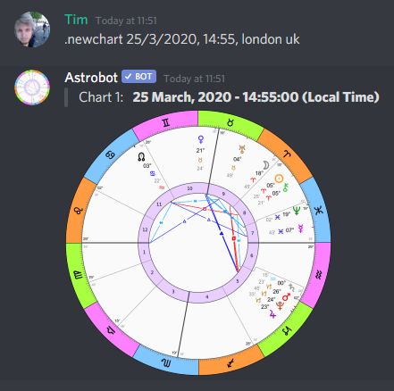
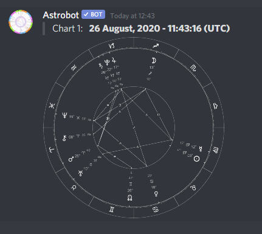
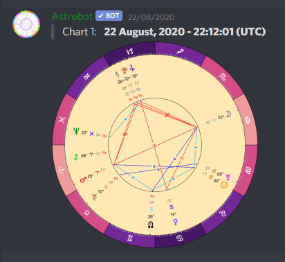
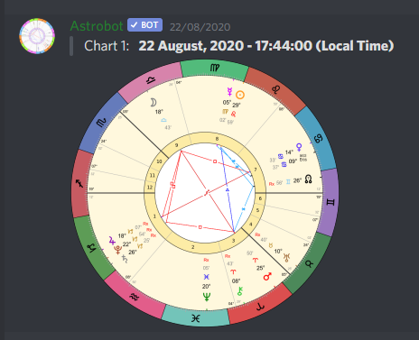

# Astrobot

A fully featured Astrology software for Discord! Astrobot can create a variety of astrological charts and supports a vast array of possibilities. Its features include:

* Planets, Stars, Asteroids, Arabic Parts, Comets, Artificial Sattelites, and more
* Tropical, Sidereal and Draconic zodiacs
* Geocentric, Topocentric and Heliocentric
* 20+ House Systems and 40+ Ayanamsas
* Biwheels and composites
* Returns, Personas, Progressions and more
* Chart management and unlimited saved charts
* Custom themes and custom orb sets
* Extremely customizable

**To add Astrobot to your Discord server click here -> [Invite Astrobot](https://discord.com/oauth2/authorize?client_id=344272098488877057&permissions=379968&scope=bot)**

**If you need any help join our support server -> [Join Astro Dev](https://discord.gg/BpeedKh)**

## Index

* **[Prefix](#prefix)**
* **[Help](#help)**
* **[Charting Commands](#charting-commands)**
	* **[Newchart](#newchart)**
	* **[Openchart](#openchart)**
	* **[Savechart](#savechart)**
	* **[Editchart](#editchart)**
	* **[Deletechart](#deletechart)**
	* **[Findchart](#findchart)**
	* **[Mycharts](#mycharts)**
* **[Utility Commands](#utility-commands)**
	* **[Findobject](#findobject)**
	* **[Objectinfo](#objectinfo)**
	* **[About](#about)**
	* **[Settings](#settings)**
	* **[Prefix](#prefix)**
* **[Additional Information](#additional-information)**
	* **[Planets](#planets)**
	* **[Houses](#houses)**
	* **[Zodiacs](#zodiacs)**
	* **[Aspects](#aspects)**
* **[Donations and Premium Features](#premium)**
* **[About Astrobot](#about-astrobot)**

## Getting Started

Astrobot can be quite complex to use at first, but once you get the hang of it its quite easy!

Astrobot's default prefix is `.` and it works in servers as well as DMs. You can also customize Astrobot's prefix in your server with the prefix command explained below.

So lets get started with Astrobot's basic commands:

### Prefix

Use this command to view and/or change Astrobot's prefix in your server. Only server owners can change the prefix.

Examples:

* `.prefix` - shows the current prefix
* `.prefix !!` - changes the prefix to `!!`
* `!!help` - use the new prefix

If you ever forget your prefix, you can also use `@astrobot` as a prefix:

* `@astrobot prefix` - shows the current prefix
* `@astrobot prefix !!` - changes the current prefix to `!!`
* `!!help` - use the new prefix

Kicking Astrobot from your server also resets its prefix.

### Help

The help command opens an interactive menu that includes almost everything on this page in an acessible way. It divides the content in sections and pages that can be easily navigated by clicking on the emoji reactions that show up at the bottom.

Examples:

* `.help` - shows the interactive help menu and displays available options
* `click on the (1) emoji` - enters the "Charting Commands" section
* `click on the (1) emoji again` - enters the "Newchart" section
* `click on the (<-) emoji` - goes back to the "Charting Commands" section
* `click on the (2) emoji` - enters the "Openchart" section
* `click on the (<-) emoji` - goes back to the "Charting Commands" section
* `click on the (<-) emoji` - goes back to main menu

And so on... (easier to see it on discord than to explain it here)

The interactive menu should alway work regardless of how old it gets so you can safely open a permanent help menu in a read-only channel and send your users there so they dont need to use it again and again in other channels.

Multiple people can use the same help menu at the same time, but if you click on the reactions too fast some clicks will be ignored to prevent overload, so avoid fighting with each other over which page to display.

## Charting Commands

These commands are used to create a variety of charts and are the core feature of Astrobot.

### Newchart

This command lets you create a variety of charts and supports an extensive amount of customization options including biwheels, solar returns, progressions, composites and more!

#### Single Charts

For starting, lets create a transit chart for a given date:

* `.newchart 20/10/1995`

The above command will generate a chart for October 20th 1995 at noon GMT. By default it expects a **DD/MM/YYYY** date but you can change it to **MM/DD/YYYY** by using the dateformat option explained in the [Settings](#settings) section.

Now if you want to give it a specific time of the day:

* `.newchart 20/10/1995, 15:30` or `.newchart 20/10/1995, 3:30pm`

This will generate a chart for October 20th 1995 at 3:30pm GMT. Both 12h and 24h time formats are supported. In both cases no houses will be shown because the chart lacks a location, so lets give it one:

* `.newchart 20/10/1995, madrid spain`
* `.newchart 20/10/1995, 15:30, madrid spain`

Now we have a chart for noon and another for 3:30pm both in the madrid timezone, and since we defined a location the charts will also display Houses!

Thats it for the basics of chart making and dont forget the commas between date, time and location (they are important). Now lets check some more advanced features below.

PS: You can also edit your commands and Astrobot will edit its response accordingly, no need to flood your chat with new charts. And if you delete your command, Astrobot will also delete its response. how cool is that? :3

#### Biwheels

Now lets say we want to create a biwheel, all you have to do is add a ` + ` sign at the end of the command (with spaces around it), and then add a new set of data the same way as before:

* `.newchart 20/10/1995, 15:30, madrid spain + 15/5/1992, 6:45am, london uk`

Now we have a biwheel displaying two charts!

#### Now

Besides the above Date, Time and Location method, you can also use the keyword `now` to create a chart for the current date and time. For example:

* `.newchart now`
* `.newchart now, madrid spain`
* `.newchart 20/10/1995, 15:30, madrid spain + now, madrid spain`

This makes it easy to check the current transits, both in a single chart and in a biwheel with another chart. The `now` keyword can also be extended by adding or removing a number of days from it:

* `.newchart now+1` - tomorrow
* `.newchart now-1` - yesterday
* `.newchart now+0.5` - 12 hours from now

Note that there should be no spaces around the plus/minus signs in this case.

#### Saved Charts

Astrobot's chart saving system lets you save charts under a name of your choice, as explained in the [Savechart](#savechart) section. Once you have a saved chart, you can easily pull it up by name, for example:

* `.newchart jack`
* `.newchart john doe`
* `.newchart john doe + now`
* `.newchart john doe + jack`

You can also load other people's charts, as long as they are public.

#### Chart Options

Additionally, there are multiple chart options that can be added to the Newchart command using the `--option=value` format. All of these options (with a few obvious exceptions) can be used together in any combination.

##### --add & --remove

These two options let you add and/or remove planets and objects from a chart. When used on biwheels, this option affects each chart independently. Additionally, the `--remove` option includes an `ALL` keyword to remove all planets. For example:

* `.newchart now --add=A1,A2 --remove=A2060` - remove Chiron and add Ceres and Pallas
* `.newchart jack --add=A1 + now --add=A1` - add Ceres to both charts
* `.newchart now --remove=ALL --add=P0,P1` - remove everything exept Sun and Moon

Because of the sheer amount of planets and objects that Astrobot supports, it makes use of an ID system to identify them. To find out which planets and objects are available and how to find them and their respective IDs, check out the [Planets](#planets) section.

##### --zodiac

This option lets you specify which zodiac should be used. When used on biwheels, this option affects each chart independently. For example:

* `.newchart now --zodiac=D1` - use the draconic (true node) zodiac
* `.newchart jack --zodiac=S1 + now --zodiac=S1` - use the fagan/bradley sidereal zodiac in both charts

Check the available zodiacs and ayanamsas in the [Zodiacs](#zodiacs) section.

##### --houses

This option lets you specify which house system should be used. When used on biwheels, this option affects each chart independently. For example:

* `.newchart now --houses=13` - use the koch house system
* `.newchart jack --houses=24 + now --houses=24` - use the whole signs house system for both charts

Check the available house systems in the [Houses](#houses) section.

##### --timezone

This option lets you specify a timezone, which overrides any automatic timezone if applicable. A timezone can be specified by a TZData identifier or by a number of offset minutes. When used on biwheels, this option affects each chart independently. For example:

* `.newchart 5/5/2015, 16:00 --timezone=America/New_York` - use the america/new_york timezone identifier
* `.newchart 5/5/2015, 16:00 --timezone=+50 + 7/7/2016, 16:00 --timezone=-50` - use UTC+00:50 on the first chart and UTC-00:50 on the second

##### --return

This option lets you create solar return charts by specifying a year and optionally a location. When used on biwheels, this option affects each chart independently. For example:

* `.newchart john --return=2021` - john's solar return for 2021 in his birth place
* `.newchart john --return=2021, london uk` - john's solar return for 2021 in london
* `.newchart john --return=2021, london uk + jack --return=2021, madrid spain` - biwheel john's solar return for 2021 in london and jack's solar return for 2021 in madrid

##### --return2

This option lets you create a return chart for any planet, by specifying a planet ID, a search direction and a date-time-location separated by commas. Available search directions are `current`, `next` and `closest`. When used on biwheels, this option affects each chart independently. For example:

* `.newchart john --return2=P1, next, now` - john's next lunar return starting from the current date and time
* `.newchart jack --return2=P2, closest, 5/5/2025 lisbon portugal` - jack's mercury return closest to 5/5/2025 in lisbon portugal
* `.newchart john --return2=P5, current, now + jack --return2=P5, current, now` - biwheel john's most recent jupiter return with jacks most recent jupiter return

##### --progression

This option lets you create a progressed chart using the secondary progressions method. When used on biwheels, this option affects each chart independently. For example:

* `.newchart john --progression=1/1/2025` - john's secondary progressed chart for 1/1/2025
* `.newchart john + john --progression=now` - john's birth chart biwheeled with his current secondary progressed chart

##### --persona

This option lets you create a "persona" chart for a specific planet. When used on biwheels, this option affects each chart independently. For example:

* `.newchart john --persona=P5` - john's jupiter persona chart
* `.newchart john --persona=P5 + john --persona=P6` - john's jupiter persona chart biwheeled with john's saturn persona chart

##### --design

This option lets you create a "design" chart as seen in the Human Design System. When used on biwheels, this option affects each chart independently. For example:

* `.newchart john --design` - john's design chart
* `.newchart john + john --design` - john's birth chart in a biwheel which his design chart

##### --coordinates

This option lets you set the chart's coordinate system between `Geocentric`, `Topocentric` and `Heliocentric`. When used on biwheels, this option affects each chart independently. For example:

* `.newchart john --coordinates=heliocentric` - john's heliocentric chart
* `.newchart john --coordinates=geocentric + john --coordinates=topocentric` - biwheel john's chart in geocentric and topocentric coordinates

##### --size

This option lets you change the resolution of the resulting chart image as well as the scale of the fonts and gyphs on the chart. For example:

* `.newchart now --size=2000` - set the chart resolution to 2000x2000 pixels
* `.newchart jack + now --size=1500,120` - set the chart resolution to 1500x1500 pixels and the font scaling to 120%

##### --theme

This option lets you change the chart's color theme. There are three built-in themes: `classic`, `elements` and `rainbow`. For example:

* `.newchart now --theme=classic` - use the classic theme for this chart

Additionally, custom themes can be created as a premium feature, check the [Premium](#premium) section.

##### --orbs

This option lets you change the chart's orb values. There are three built-in orbs: `astrobot`, `astro.com` and `strict`. For example:

* `.newchart now --orbs=strict`

Additionally, custom orbs can be created as a premium feature, check the [Premium](#premium) section

##### --aspects

This option lets you define which aspects should be enabled in the chart. For example:

* `.newchart now --aspects=trine,sextile,square` - show only trines, sextiles and squares

A full list of supported aspects can be found in the [Aspects](#aspects) section.

##### --disable & --enable

These options let you disable or re-enable a planet's aspect points. Additionally, they include an `ALL` keyword for selecting all planets. For example:

* `.newchart now --disable=P0,P1,P2` - disable aspects for the sun, moon and mercury
* `.newchart jack + now --enable=A1` - re-enable aspects to Ceres if disabled
* `.newchart john --disable=ALL --enable=P0,P1` - disable aspects for all planets except Sun and Moon

##### --composite

This option lets you turn a biwheel into a composite chart using the midpoint composite method. For example:

* `.newchart jack + john --composite` - create a midpoint composite between jack and john

##### --preset

This option lets you load a set of options from a preset. There are two built-in presets: `default` and `original`. When using biwheels, this option can be set separately for both charts. For example:

* `.newchart jack --preset=default` - show this chart using the default settings
* `.newchart jack --preset=original` - show this chart in its original state, using the same settings it was saved with
* `.newchart jack --preset=myPreset` - show this chart using a custom preset
* `.newchart jill --preset=myPreset + jack --preset=original` - show jill's chart with a custom preset in a biwheel with jack's chart in its original state

Check out the [Presets](#presets) section to learn how to create and manage your custom presets.

##### --chartinfo

This option lets you view more details about the chart or charts. When viewing other people's charts, any personal information will be redacted. For example

`.newchart john --chartinfo` - view more information about john's chart

### Openchart

This command loads a saved chart in its original state, exactly as it was when it was saved. It is essentially a shortcut for `--preset=original`, it can only open saved charts and doesnt support additional options. For example:

* `.openchart daniel` - show daniel's chart in its original state

### Savechart

This command lets you save the last chart you created under a name of your choice. All names are case sensitive and must not include commas, double dashes nor slashes and mentions will be converted to Discord IDs For example:

* `.savechart mychart` - save the last chart you created under the name `mychart`

#### Savechart Options

A chart can be saved as public or private, and also be shared with specific people, check out the following options:

##### --private & --share

Save this chart as a private chart. Private charts can only be opened by their owners and the people the chart was shared with. For example:

* `.savechart mychart --private` - save this chart as private
* `.savechart mychart --private --share=@myfriend` - save this chart as private and share it with a specific person

##### --replace

If you already have a saved chart with a given name and you want to replace it, you can use this option to overwrite it:

* `.savechart myexistingchart --replace` - replace your previous chart with a new one

### Editchart

This command lets you view information about one of your saved charts as well as change its name and privacy settings. For example:

* `.editchart chartname` - view information about your chart

##### --rename

Change the name of your saved chart:

* `.editchart mychart --rename=mychart2` - change your chart's name to `mychart2`

##### --private

Toggle your chart's privacy:

* `.editchart mychart --private` - toggle this chart's privacy setting

##### --share

If this chart is private, change who can use it:

* `.editchart mychart --share=@myfriend` - share this chart with another person or unshare it if its already shared with this person
* `.editchart mychart --share=none` - unshare this chart with everyone

### Deletechart

This command lets you permanently delete a chart. You can only delete charts you own. For example:

* `.deletechart mychart` - permanently delete `mychart`

### Findchart

This command lets you find a saved chart by name. If you find too many results, try searching for a more specific term. For example:

* `.findchart john` - show all charts containing `john` in their names

### Mycharts

This command lets you see all charts you have saved with your current discord account. For example:

* `.mycharts` - show all the charts you own

## Utility Commands

The following utility commands provide assistance with many things for example finding object IDs by name, changing personal settings and more.

### Findobject

This command lets you search for objects by name and discover their ID. If you cant find the object you're looking for, try a more specific search term as well as any alternative names it may have. For example:

* `.findobject eris` - show all planets, stars and objects whose names contain `eris`

##### --type

Limit the search results to specific types. For example:

* `.findobject eris --type=A` - show only asteroids whose name contains `eris`

More information about types can be found in the [Planets](#planets) section.

### Objectinfo

This command shows you information about a specific object ID, its names, type and a preview of how it appears in a chart. For example:

* `.objectinfo P5` - show information about object P5 (jupiter)

More information about common object IDs can be found in the [Planets](#planets) section

### About

This command lets you obtain information about certain topics and components used by Astrobot such as glyphs, orbs, aspects and more.

* `.about` - list components that offer additional information

#### About Glyphs

This option creates an image showing a preview and a description of every glyph and symbol that Astrobot uses including planets, asteroids and more:

* `.about glyphs` - display all glyphs

#### About Aspects

This option creates an image showing a preview and the degrees of distance of every aspect supported by Astrobot:

* `.about aspects` - display all aspects

#### About orbs

This option displays a list of available orb sets, as well as orb details about a specific set:

* `.about orbs` - display a list of available orb sets
* `.about orbs astro.com` - describe the orb values of the `astro.com` orbs set

#### About Houses

This option displays a list of available house systems:

* `.about houses` - display a list of available house systems

Or check the list of house systems in the [Houses](#houses) section.

#### About Zodiacs

This option displays a list of available zodiacs and ayanamsas:

* `.about zodiacs` - display a list of available zodiacs

Or check the list of zodiacs and ayanamsas in the [Zodiacs](#zodiacs) section.

### About Planets

This option diplays a list of commonly used planets and their IDs:

* `.about planets` - display a list of common planets

Or check the list of planets in the [Planets](#planets) section.

### Settings

This command lets you configure your preferred default settings for all your charts. These settings are applied to all charts created using the `.newchart` command, including saved charts unless overriden by chart options or presets. Settings are divided into sections for easier management.

#### Settings Sections

The following sections are available to display your current settings. Each section also displays instructions for how to edit/configure it.

* `.settings planets` - display your currently enabled planets as well as their aspect points settings
* `.settings aspects` - display your currently enabled aspects as well as available aspects to chose from
* `.settings houses` - display your current preferred house system as well as available house systems to chose from
* `.settings zodiac` - display your current preferred zodiac as well as available zodiacs to chose from
* `.settings themes` - display your current chart theme as well as available themes to chose from
* `.settings orbs` - display your current orbs set as well as available sets to chose from
* `.settings dateformat` - display your current preferred date format (DD/MM/YYYY or MM/DD/YYYY)
* `.settings coordinates` - display your current preferred coordinate system
* `.settings presets` - display your saved presets

#### Settings Options

The following options are available to change your personal settings.

##### --addplanets & --removeplanets

Add and remove planets from your settings. For example:

* `.settings --addplanets=A1,A2,A3` - add Ceres, Pallas and Juno to your settings
* `.settings --removeplanets=P7,P8,P9` - remove Uranus, Neptune and Pluto from your settings

##### --enableplanets & --disableplanets

Disable and re-enable aspects points for your selected planets. All planets have their aspect points enabled by default. For example:

* `.settings --disableplanets=A1,A2,A3` - disable aspect points to Ceres, Pallas and Juno
* `.settings --enableplanets=A1,A2,A3` - re-enable previously disabled aspect points

##### --enableaspects & --disableaspects

Enable and disable your preferred aspects. For example:

* `.settings --enableaspects=conjunction,quincunx` - enable conjunctions and quincunxes
* `.settings --disableaspects=sextile,opposition` - disable sextiles and oppositions

##### --houses

Set your preferred house system. For example:

* `.settings --houses=24` - set Whole Signs as your default house system

##### --zodiac

Set your preferred zodiac. For example:

* `.settings --zodiac=S2` - set Lahiri as your default zodiac

##### --theme

Set your preferred chart theme. For example:

* `.settings --theme=rainbow` - set rainbow as your default theme

##### --orbs

Set your preferred orbs set

* `.settings --orbs=strict` - set your default orbs to strict

##### --switchdateformat

Switch your preferred date format between **DD/MM/YYYY** and **MM/DD/YYYY**. For example:

* `.settings --switchdateformat` - switch to another date format

##### --coordinates

Set your preferred coordinates system. For example:

* `.settings --coordinates=HELIOCENTRIC` - set Heliocentric as your default coordinates system

##### --savepreset & --loadpreset & --deletepreset

Manage your saved presets. Additionally a built-in `default` preset is available to reset all settings back to default. For example:

* `.settings --savepreset=custom1` - save all your current settings as a preset named custom1
* `.settings --loadpreset=custom1` - replace all your current settings with those contained in the custom1 preset
* `.settings --deletepreset=custom1` - delete the custom1 preset
* `.settings --loadpreset=default` - reset all settings back to default

### Prefix

See [Prefix](#prefix)

## Additional Information

More information about Astrobot, including how its planet ID system works, all available house systems, zodiacs, aspects and more.

### Planets

Astrobot uses an ID system due to the sheer amount of planets and objects it supports.

#### Object Types

Each planet and object has a unique ID starting with an object type represented by a letter:

| Object Type | Descripton |
|---|---|
| P | Planets and special objects |
| A | Asteroids |
| S | Stars |
| H | Hypothetical Planets |
| C | Comets |
| L | Arabic parts/lots |
| T | Artificial Satellites |

Asteroids and Artificial Satellites use the same numbering system they are commonly known to use (MPC Designation for Asteroids, SATCAT number for Satellites). Other object types do not follow any known numbering system and are instead organized either alphabetically, by importance, on a "first comes" basis or by any combination of those.

#### Common Objects

Some of the most common objects IDs are listed below. This list can also be found using the `.about planets` command.

| ID | Object |
|---|---|
| P0 | Sun |
| P1 | Moon |
| P2 | Mercury |
| P3 | Venus |
| P4 | Mars |
| P5 | Jupiter |
| P6 | Saturn |
| P7 | Uranus |
| P8 | Neptune |
| P9 | Pluto |
| P10 | Mean Ascending (North) Node |
| P11 | True Ascending (North) Node |
| P23 | Mean Descending (South) Node |
| P24 | True Descending (South) Node |
| P14 | Earth |
| P12 | Mean Lilith |
| P13 | True Lilith |
| P21 | Natural Lilith |
| A1 | Ceres |
| A2 | Pallas |
| A3 | Juno |
| A4 | Vesta |
| A2060 | Chiron |
| C1 | Comet Halley |
| H1 | Cupido |
| H2 | Hades |
| H3 | Kronos |
| H4 | Apollon |
| H5 | Admetos |
| H6 | Vulkanus |
| H7 | Poseidon |
| L118 | Part of Fortune |
| L119 | Part of Spirit |
| S3071 | Aldebaran |
| S1351 | Regulus |
| S3099 | Sirius |
| S1224 | Vega |
| S2665 | Spica |

To find the ID of a specific object, check out the **[Findobject](#findobject)** command.

### Houses

Astrobot supports many different House Systems listed below. The list can also be found using the `.about houses` command.

| ID | House System |
|---|---|
| 1 | Alcabitius |
| 2 | APC |
| 3 | Axial Rotation / Meridian / Zariel |
| 4 | Azimuthal / Horizontal |
| 5 | Campanus |
| 6 | Carter / Poli-Equatorial |
| 7 | Equal (1st House = Ascendant) |
| 8 | Equal (10th House = Midheaven) |
| 9 | Equal (1st House = 0° Aries) |
| 10 | Gauquelin Sectors |
| 11 | Sunshine / Makransky (Treindl) |
| 12 | Sunshine / Makransky (Makransky) |
| 13 | Koch |
| 14 | Krusinski / Pisa / Goelzer |
| 15 | Morinus |
| 16 | Placidus |
| 17 | Polich / Page / Topocentric |
| 18 | Porphyry |
| 19 | Pullen SD / Neo-Porphyry |
| 20 | Pullen SR |
| 21 | Regiomontanus |
| 22 | Sripati |
| 23 | Vehlow Equal |
| 24 | Whole Sign |
| none | none (disable houses) |

### Zodiacs

Astrobot suports many types of zodiacs, including Tropical, Sidereal and Draconic. Sidereal zodiacs also have many different calculation methods or "Ayanamsas" to chose from. The list below can also be found using the `.about zodiacs` command.

| ID | Zodiac / Ayanamsa |
|---|---|
| T | Tropical |
| D1 | Draconic (True Node) |
| D2 | Draconic (Mean Node) |
| S1 | Fagan / Bradley |
| S2 | Lahiri |
| S3 | De Luce |
| S4 | Raman |
| S5 | Usha / Shashi |
| S6 | Krishnamurti |
| S7 | Djwhal Khul |
| S8 | Yukteshwar |
| S9 | J.N. Bhasin |
| S10 | Babylonian / Kugler 1 |
| S11 | Babylonian / Kugler 2 |
| S12 | Babylonian / Kugler 3 |
| S13 | Babylonian / Huber |
| S14 | Babylonian / Eta Piscium |
| S15 | Babylonian / Aldebaran at 15° Taurus |
| S16 | Hipparchos |
| S17 | Sassanian |
| S18 | Galactic Center at 0° Sagittarius |
| S19 | J2000 |
| S20 | J1900 |
| S21 | B1950 |
| S22 | Suryasiddhanta |
| S23 | Suryasiddhanta (mean Sun) |
| S24 | Aryabhata |
| S25 | Aryabhata (mean Sun) |
| S26 | SS Revati |
| S27 | SS Citra |
| S28 | True Citra |
| S29 | True Revati |
| S30 | True Pushya (PVR Narasimha Rao) |
| S31 | Galactic Center (Gil Brand) |
| S32 | Galactic Equator (IAU1958) |
| S33 | Galactic Equator |
| S34 | Galactic Equator mid-Mula |
| S35 | Skydram (Mardyks) |
| S36 | True Mula (Chandra Hari) |
| S37 | Dhruva / Galactic Center / Mula (Wilhelm) |
| S38 | Aryabhata 522 |
| S39 | Babylonian / Britton |
| S40 | Vedic / Sheoran |
| S41 | Cochrane / Galactic Center at 0° Capricorn |
| S42 | Galactic Equator (Fiorenza) |
| S43 | Vettius Valens |
| S44 | Sheratan at 2°15' Aries |
| S45 | Vasilis Kanatas |

### Aspects

Astrobot supports many different aspects to chose from. The list below can also be found using the `.about aspects` command, which also include a preview of its glyphs and how they look in a chart.

| Aspect | Distance (degrees) |
|---|---|
| conjunction | 0 |
| opposition | 180 |
| trine | 120 |
| square | 90 |
| quintile | 72 |
| bi-quintile | 144 |
| sextile | 60 |
| septile | 51.42857142857143 |
| bi-septile | 102.8571428571429 |
| tri-septile | 154.2857142857143 |
| semi-square | 45 |
| sesqui-square | 135 |
| novile | 40 |
| bi-novile | 80 |
| quadri-novile | 160 |
| decile | 36 |
| tri-decile | 108 |
| undecile | 32.72727272727273 |
| bi-undecile | 65.45454545454545 |
| tri-undecile | 98.18181818181819 |
| quadri-undecile | 130.9090909090909 |
| quinque-undecile | 163.63636363636363 |
| semi-sextile | 30 |
| quincunx | 150 |
| tredecile | 27.69230769230769 |
| bi-tredecile | 55.38461538461538 |
| tri-tredecile | 83.07692307692308 |
| quadri-tredecile | 110.7692307692308 |
| quinque-tredecile | 138.4615384615385 |
| sexa-tredecile | 166.1538461538462 |
| semi-septile | 25.71428571428571 |
| sesqui-septile | 77.14285714285714 |
| sester-septile | 128.5714285714286 |
| quindecile | 24 |
| bi-quindecile | 48 |
| quadri-quindecile | 96 |
| septua-quindecile | 168 |
| quarti-square | 22.5 |
| tri-quarti-square | 67.5 |
| quinque-quarti-square | 112.5 |
| septua-quarti-square | 157.5 |
| semi-novile | 20 |
| quinque-semi-novile | 100 |
| septua-semi-novile | 140 |
| vigintile | 18 |
| tri-vigintile | 54 |
| septua-vigintile | 126 |
| nona-vigintile | 126 |
| quarti-sextile | 15 |
| squile | 75 |
| squine | 105 |
| undeca-quarti-sextile | 165 |

## Premium

Astrobot is and will always be 100% free without limitations, but in order to help with development and maintenance costs, it offers a few "premium" features you can obtain by becoming a patron. Once you've pledged, send a DM to `Tim#2373` to receive instructions for receiving your premium features.

[Support Astrobot on Patreon](https://patreon.com/timotejroiko)

### Custom Orbs ($3+)

Astrobot includes 3 free orb sets to chose from. Becoming a $3+ patron lets you create your own custom orbs set with custom orb values for all aspects. Orb values can be defined on a per-aspect or a per-planet basis. Custom orbs are personal and can only be used by the person who owns them, but you can gift custom orbs to someone else.

### Custom Theme ($6+)

Astrobot includes 3 free chart themes for everyone to chose from. Becoming a $6+ patron allows you to design your own custom theme! Custom themes are extremely customizable and let you change the colors of almost everything in the chart. Here are a few examples of custom themes created by our lovely supporters:

  

Custom themes are personal and can only be used by the person who owns them, but you can gift custom themes to someone else.

### Custom Theme for Servers ($12+)

Spice up your discord server with a server-wide custom theme! Becoming a $12+ patron lets you define a custom theme for an entire server. Server-wide themes are applied to all charts created and opened in it but individual users can still override it and/or turn it off if they prefer a different theme.

## About Astrobot

Astrobot is an Astrology Discord bot made with love by `Tim#2373`

Check out my other projects: [https://github.com/timotejroiko](https://github.com/timotejroiko)  
Join me on Discord: [https://discord.gg/BpeedKh](https://discord.gg/BpeedKh)  
Support me on Patreon: [https://patreon.com/timotejroiko](https://patreon.com/timotejroiko)  

